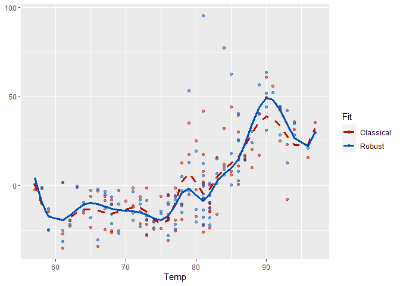
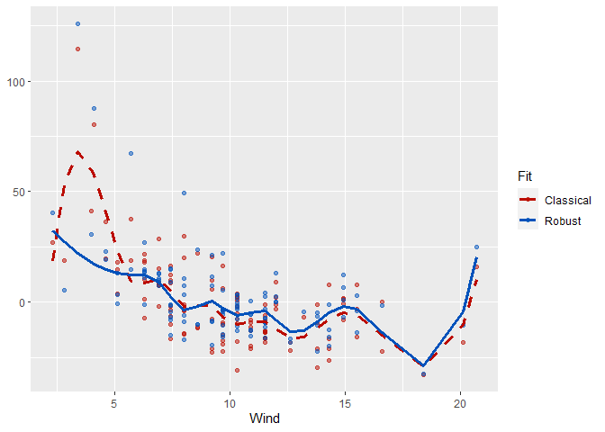
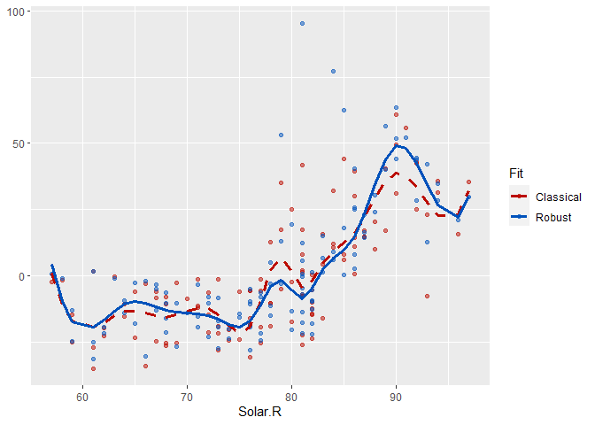

Let first install package <code>rplam</code>.

``` r
library(devtools)
install_github("alemermartinez/rplam")
library(rplam)
```

The following is a real-data example of the implemention of the robust estimator based on B-splines under a partial linear additive model.

``` r
data(airquality)
x <- airquality
x <- x[ complete.cases(x), ]
x <- x[, c('Ozone', 'Solar.R', 'Wind', 'Temp','Month')]
y <- as.vector(x$Ozone)
X <- as.matrix(x[, c('Solar.R', 'Wind', 'Temp')])
Z <- as.matrix(x[, 'Month'])
```

As the is taken as a categorical variable, we convert it into a factor variable.

``` r
Z <- as.factor(Z)
```

The degree selected for the spline basis is 3 for the three additive functions.

``` r
degree.spline <- 3
```

The number of internal knots selected by the BIC criteria for the classical estimator is 9.

``` r
nk.cl <- select.nknots.cl(y,Z,X,degree.spline=degree.spline)
nk.cl$nknots
```

    ## [1] 9

And so is the number of internal knots selected using the RBIC criteria used for the robust proposal.

``` r
nk.rob <- select.nknots.rob(y,Z,X,degree.spline=degree.spline)
nk.rob$nknots
```

    ## [1] 9

Classical estimation of a partial linear additive model

``` r
fit.full.cl <- plam.cl(y,Z,X,degree.spline=degree.spline)
```

and the robust proposal

``` r
fit.rob <- plam.rob(y,Z,X,degree.spline=degree.spline)
```

When no number of internal knots is specified, select.knots.cl or select.knots.rob, respectively, is used.

The following three plots correspond to the classical (in red) and robust (in blue) fits for the additive functions with their respectively partial residuals. 

Since fits are not quite similar, we are going to study the residuals obtained by the robust estimator.

``` r
res.rob <- y-fit.rob$prediction
summary(res.rob)
```

    ##     Min.  1st Qu.   Median     Mean  3rd Qu.     Max. 
    ## -21.7551  -6.2581  -0.2832   2.6631   7.6366 103.6170

    ## 
    ## ********************************************************

    ## Note: As of version 1.0.0, cowplot does not change the

    ##   default ggplot2 theme anymore. To recover the previous

    ##   behavior, execute:
    ##   theme_set(theme_cowplot())

    ## ********************************************************


