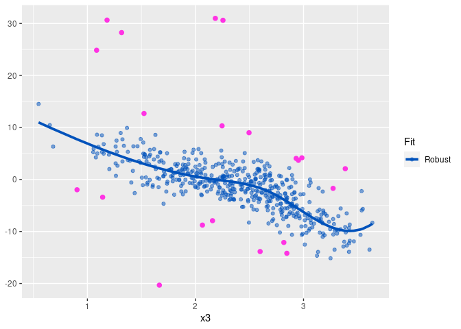

The following real data example of the implementation of robust estimators based on B-splines under partially linear additive model is part of a work in progress done in collaboration with Prof. Dr. Graciela Boente.

Let first install package <code>rplam</code>.

``` r
library(devtools)
install_github("alemermartinez/rplam")
library(rplam)
```

We will use the Air Quality data set available in <code>R</code>.

``` r
data(airquality)
x <- airquality
x <- x[ complete.cases(x), ]
x <- x[, c('Ozone', 'Solar.R', 'Wind', 'Temp','Month')]
y <- as.vector(x$Ozone)
X <- as.matrix(x[, c('Solar.R', 'Wind', 'Temp')])
Z <- as.matrix(x[, 'Month'])
```

As the is taken as a categorical variable, we convert it into a factor variable.

``` r
Z <- as.factor(Z)
```

The degree selected for the spline basis is 3 for the three additive functions.

``` r
degree.spline <- 3
```

The number of internal knots selected by the BIC criteria for the classical estimator is 9.

``` r
nk.cl <- select.nknots.cl(y,Z,X,degree.spline=degree.spline)
nk.cl$nknots
```

    ## [1] 1

And so is the number of internal knots selected using the RBIC criteria used for the robust proposal.

``` r
nk.rob <- select.nknots.rob(y,Z,X,degree.spline=degree.spline)
nk.rob$nknots
```

    ## [1] 1

Classical estimation of a partially linear additive model

``` r
fit.full.cl <- plam.cl(y,Z,X,degree.spline=degree.spline)
```

and the robust proposal

``` r
fit.rob <- plam.rob(y,Z,X,degree.spline=degree.spline)
```

When no number of internal knots is specified, functions select.knots.cl or select.knots.rob, respectively, is used.

The estimations obtained for each linear coefficient for both classical and robust approaches are shown it the following Table.

|                 |   Classical|      Robust|
|-----------------|-----------:|-----------:|
| *β*<sub>0</sub> |   46.053662|  40.6513100|
| *β*<sub>1</sub> |   -6.736466|  -5.6409264|
| *β*<sub>2</sub> |   -4.613679|  -0.5397012|
| *β*<sub>3</sub> |    3.906954|   5.1664537|
| *β*<sub>4</sub> |  -12.008022|  -5.8161019|

The following three plots correspond to the classical (in red and dashed line) and robust (in blue and solid line) fits for the additive functions with their respectively partial residuals. 

It seems curves obtained for each additive component are quite differents. For this reason, we are going to study the residuals obtained by the robust estimator.

``` r
res.rob <- y-fit.rob$prediction
summary(res.rob)
```

    ##     Min.  1st Qu.   Median     Mean  3rd Qu.     Max. 
    ## -27.4217  -6.7043  -0.2795   2.4806   7.7085 102.9287


The residuals detected as outliers are:

``` r
p1.info$outliers[[1]]
```

    ## [1]  69.68170  66.01789  44.79089 102.92874

which correspond to observations 23, 34, 53 and 77. Highlighting the partial residuals of these four observations (in pink) we obtain the following plots:



Now, we remove these four observations from the original data set and re-calculate the classical estimator

``` r
out.pos <- c(23,34,53,77)
y.del <- y[-out.pos]
X.del <- X[-out.pos,]
Z.del <- Z[-out.pos]

fit.del.cl <- plam.cl(y.del, Z.del, X.del)
```

New estimated linear coefficients with the previuos ones are shown in the following table.

|                 |   Classical|      Robust|  Classical on clean data|
|-----------------|-----------:|-----------:|------------------------:|
| *β*<sub>0</sub> |   46.053662|  40.6513100|               39.3740650|
| *β*<sub>1</sub> |   -6.736466|  -5.6409264|               -4.9202606|
| *β*<sub>2</sub> |   -4.613679|  -0.5397012|               -0.1260116|
| *β*<sub>3</sub> |    3.906954|   5.1664537|                6.4751791|
| *β*<sub>4</sub> |  -12.008022|  -5.8161019|               -5.5576644|

The following plots correspond to the new curves obtained with the classical fit (in red dashed line) using the data without the potential outliers identified by the robust fit together with the curves obtained by the robust fit on the original data set.


