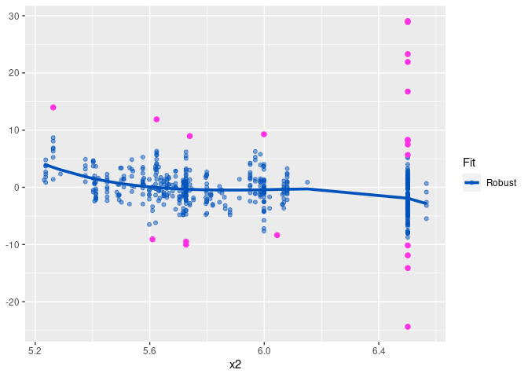
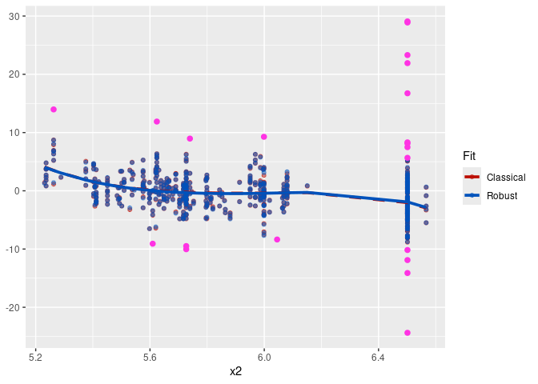
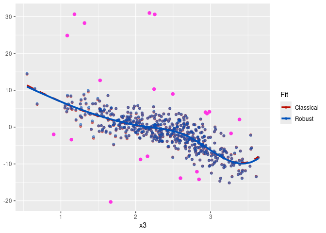

The following real data example of the implementation of robust
estimators based on B-splines under partially linear additive model is
part of a work in progress done in collaboration with Prof. Dr. Graciela
Boente.

Let first install package <code>rplam</code>.

``` r
library(devtools)
install_github("alemermartinez/rplam")
library(rplam)
```

We will use the Boston housing data set available in <code>R</code>.

``` r
library(MASS)
attach(Boston)
str(Boston)
```

    ## 'data.frame':    506 obs. of  14 variables:
    ##  $ crim   : num  0.00632 0.02731 0.02729 0.03237 0.06905 ...
    ##  $ zn     : num  18 0 0 0 0 0 12.5 12.5 12.5 12.5 ...
    ##  $ indus  : num  2.31 7.07 7.07 2.18 2.18 2.18 7.87 7.87 7.87 7.87 ...
    ##  $ chas   : int  0 0 0 0 0 0 0 0 0 0 ...
    ##  $ nox    : num  0.538 0.469 0.469 0.458 0.458 0.458 0.524 0.524 0.524 0.524 ...
    ##  $ rm     : num  6.58 6.42 7.18 7 7.15 ...
    ##  $ age    : num  65.2 78.9 61.1 45.8 54.2 58.7 66.6 96.1 100 85.9 ...
    ##  $ dis    : num  4.09 4.97 4.97 6.06 6.06 ...
    ##  $ rad    : int  1 2 2 3 3 3 5 5 5 5 ...
    ##  $ tax    : num  296 242 242 222 222 222 311 311 311 311 ...
    ##  $ ptratio: num  15.3 17.8 17.8 18.7 18.7 18.7 15.2 15.2 15.2 15.2 ...
    ##  $ black  : num  397 397 393 395 397 ...
    ##  $ lstat  : num  4.98 9.14 4.03 2.94 5.33 ...
    ##  $ medv   : num  24 21.6 34.7 33.4 36.2 28.7 22.9 27.1 16.5 18.9 ...

``` r
y <- medv
Z <- as.matrix(ptratio)
X <- cbind(rm, log(tax), log(lstat))
```

The degree selected for the spline basis is 3 for the three additive
functions.

``` r
degree.spline <- 3
```

Classical estimation of a partially linear additive model

``` r
fit.full.cl <- plam.cl(y,Z,X,degree.spline=degree.spline)
```

and the robust proposal

``` r
fit.rob <- plam.rob(y,Z,X,degree.spline=degree.spline)
```

The number of terms for the approximation of the additive functions
selected by the BIC criteria used for the classical approach is

``` r
fit.full.cl$kj
```

    ## [1] 5

while for the robust proposal that uses the robust BIC criteria is algo

``` r
fit.rob$kj
```

    ## [1] 5

The estimations obtained for each linear coefficient for both classical
and robust approaches are shown it the following Table.

|                 |  Classical|   Robust|
|:----------------|----------:|--------:|
| *β*<sub>0</sub> |     39.340|  37.9982|
| *β*<sub>1</sub> |     -0.575|  -0.5099|

The following three plots correspond to the classical (in red and dashed
line) and robust (in blue and solid line) fits for the additive
functions with their respectively partial residuals.


Even though the shape of the estimates corresponding to the second
additive component is similar for both estimators, differences are
observed in the estimation of the first and third additive component. To
identify potential outliers, we use the boxplot of the residuals
obtained by the robust fit.

``` r
res.rob <- y-fit.rob$prediction
DF3 <- as.data.frame(list(
  1:n,
  y-fit.rob$prediction
))
names(DF3) <- c("Position","Residuals")
ggplot(DF3,aes(y=Residuals))+
  geom_boxplot(fill='#0052bb',alpha=0.5)+
  theme(
    axis.text.x=element_blank()
  )
```

 The residuals
detected as outliers are:

``` r
names(res.rob) <- 1:n
outliers <- as.numeric(names(boxplot(res.rob, plot=FALSE)$out))
outliers
```

    ##  [1]   8 158 182 215 227 233 343 365 369 370 371 372 373 376 381 392 408 409 410
    ## [20] 454 506

Highlighting the partial residuals of these four observations (in pink)
we obtain the following plots:


Now, we remove these four observations from the original data set and
re-calculate the classical estimator

``` r
y.del <- y[-outliers]
X.del <- X[-outliers,]
Z.del <- as.matrix(Z[-outliers,])

fit.del.cl <- plam.cl(y.del, Z.del, X.del)
```

The same number of terms for the approximations were selected:

``` r
fit.del.cl$kj
```

    ## [1] 5

New estimated linear coefficients with the previous ones are shown in
the following table.

|                 |  Classical|   Robust|  Classical on clean data|
|:----------------|----------:|--------:|------------------------:|
| *β*<sub>0</sub> |     39.340|  37.9982|                  37.2467|
| *β*<sub>1</sub> |     -0.575|  -0.5099|                  -0.4733|

The following plots correspond to the new curves obtained with the
classical fit (in red dashed line) using the data without the potential
outliers identified by the robust fit together with the curves obtained
by the robust fit on the original data set.


